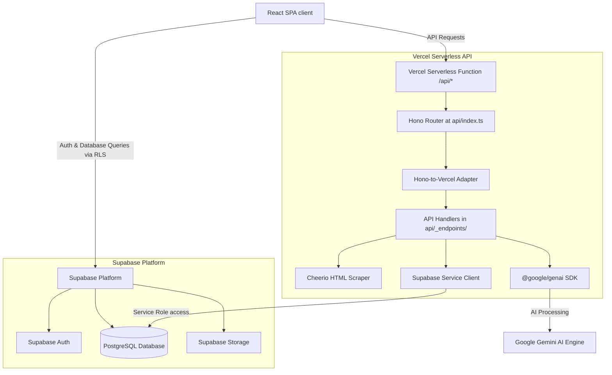
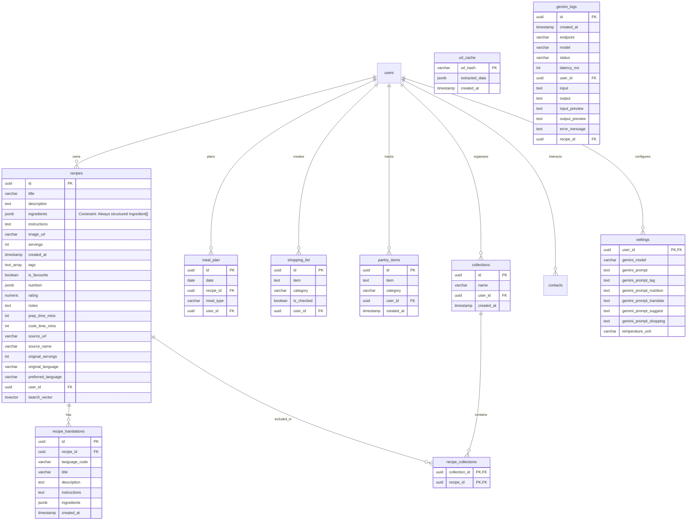

# Recipe Vault Architecture

This document describes the system architecture, data models, technical stack, and design patterns of the **Recipe Vault** application. It reflects the latest implemented state, including the recent migration to unified APIs, normalized database constraints, in-memory candidate ranking, and server-side filtering and sorting.

---

## System Overview

Recipe Vault is built as a modern, serverless web application. It combines a single-page React frontend, a unified serverless Hono API gateway, a hosted PostgreSQL database with row-level security (RLS), and Gemini AI integration.

---

## Technology Stack

| Layer | Component | Details |
|---|---|---|
| **Frontend** | React 19 / Vite 8 / TS | Core runtime environment and build toolchain. |
| **Styling** | Tailwind CSS / shadcn/ui | Component layout using utility-first classes and `@base-ui/react` primitives. |
| **Database** | Supabase PostgreSQL | Relational storage with row-level security policies (RLS). |
| **Authentication** | Supabase Auth | User login, registration, password recovery, and email magic links. |
| **Backend API** | Hono / Vercel Serverless | Consolidated API gateway handling routing inside a single warmed-up serverless function. |
| **AI Engine** | Google Gemini | Generative AI integration using the official `@google/genai` library. |
| **Monitoring** | Sentry | Full-stack error recording and latency monitoring. |

---

## Database Schema Design

The Supabase PostgreSQL database contains the following tables:

---

## Core Architectural Patterns

### 1. Unified Hono Serverless API Router
The API resides under a unified gateway router at `/api/index.ts` utilizing Hono:
*   All endpoints are located inside a private `/api/_endpoints/` directory. Vercel ignores files prefixed with an underscore, preventing duplicate compilations.
*   A type-safe Hono-to-Vercel adapter (`/api/_lib/honoAdapter.ts`) intercepts Hono requests, extracts parameters, mocks `VercelRequest` and `VercelResponse` objects, and executes handlers.
*   By bundling all controllers into a single serverless deployment, the warm instance is shared across concurrent triggers (e.g. tagging and nutrition estimation on save), reducing cold start delays to nearly zero.

### 2. Database-Level Filtering & Complete Pagination
The main recipe vault operations are performed entirely in PostgreSQL:
*   Tag filtering (using `.contains('tags', ...)`), collection lookups (using `.in('id', ids)`), search queries (using `.textSearch()`), and sorting are constructed dynamically at the database level inside `useRecipes.ts`.
*   This database-driven design eliminates client-side sorting/filtering overhead and keeps the "Load more" pagination button fully active across all filter and search contexts, enabling access to large vaults.

### 3. Normalized Database Schema for Ingredients
The `ingredients` column in the `recipes` table is fully normalized and guarded:
*   A database migration (`0036_normalize_ingredients.sql`) converted all legacy text string array entries into structured JSON objects `{ amount: string, name: string, details: string }`.
*   A Postgres database check constraint (`chk_ingredients_format`) enforces that all future entries strictly adhere to the structured array format, eliminating technical debt and guaranteeing field alignment.

### 4. Smart Local Candidate Pre-Filtering
To avoid high token overhead and long context latency inside the recipe suggest engine `/api/suggest`:
*   The API queries up to 200 of the user's recipes from the database and runs a local, in-memory string-matching scoring algorithm in JavaScript.
*   It filters candidates down to the top 30 most relevant candidates based on ingredient match overlap before compiling the prompt for Gemini. This reduces context size and cuts cumulative latency by 70–80%.

### 5. Multi-modal AI Ingestion Pipeline
*   **Web Scraping (Cheerio)**: Fetches raw HTML, strips boilerplate elements (scripts, styles, navigation, footers), hashes the URL to check the `url_cache` table (7-day TTL), and passes structured text content to Gemini.
*   **Photo Extraction**: Transmits Base64 encoded images directly to the Gemini multimodal model, matching user-preferred temperature units.
*   **PDF Extraction**: Decodes document data and parses tabular and text-based layouts using the `@google/genai` document parser.

---

## Future Architectural Improvement Opportunities

### 1. Unified Global State Manager
> [!NOTE]
> **Issue**: The codebase uses isolated custom hooks (`useRecipes`, `useMealPlans`, `useShoppingList`) that maintain localized states. This creates potential desynchronization risks across the application tree and leads to redundant database fetches.
*   **Actionable Solution**:
    *   Introduce a lightweight state management store (such as `Zustand`) or a unified React Context provider for global records (Recipes, Meal Plans, Shopping Lists, User Settings). This guarantees a single source of truth and instant visual updates when mutations occur.

### 2. Embeddings-Based Vector Search for Recommender
> [!TIP]
> **Issue**: The suggest algorithm utilizes string match pre-filtering for 200 recipes. For vaults containing thousands of recipes, this may miss candidate entries outside the order limits.
*   **Actionable Solution**:
    *   Implement vector search. Generate text embeddings for each recipe using pgvector in Supabase and match available ingredients using cosine similarity inside SQL queries, bypassing token boundaries.

### 3. Progressive Web App (PWA) Offline Capability
> [!NOTE]
> **Issue**: The application is installable but fails to operate or render without an active network connection.
*   **Actionable Solution**:
    *   Add `vite-plugin-pwa` to the Vite configuration.
    *   Setup a custom service worker caching project assets and caching recipe entries in local IndexedDB storage to support offline browsing.
